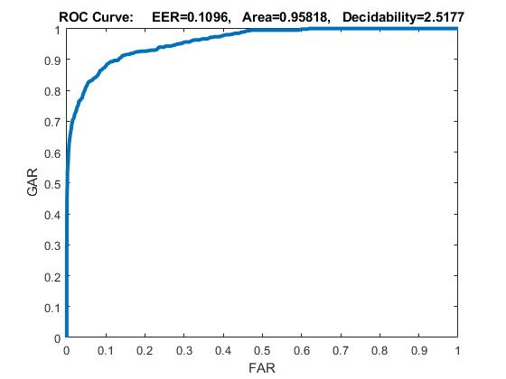
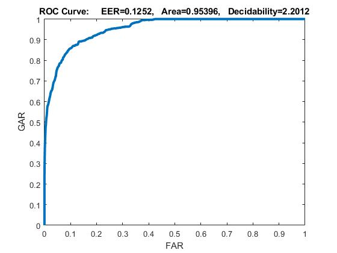
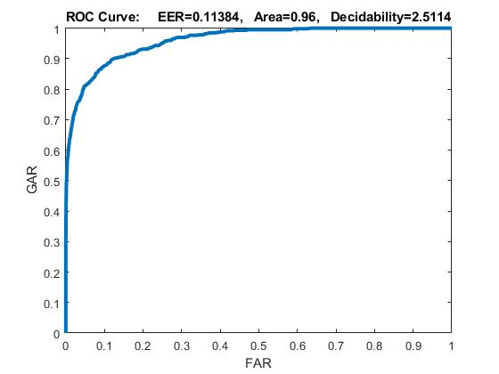
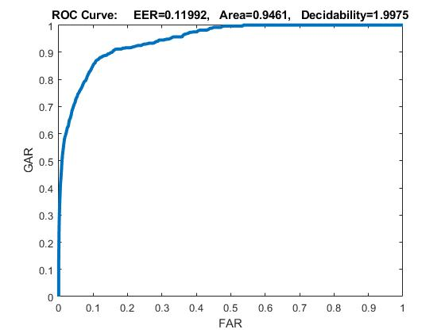
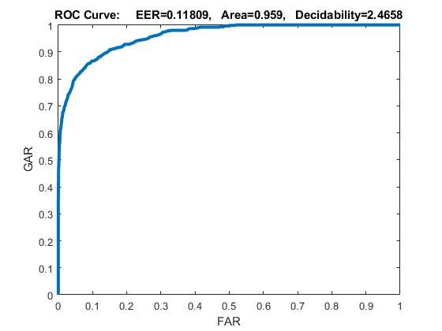
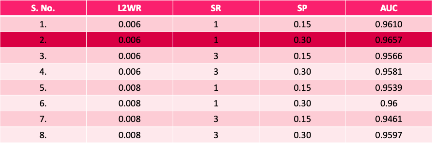
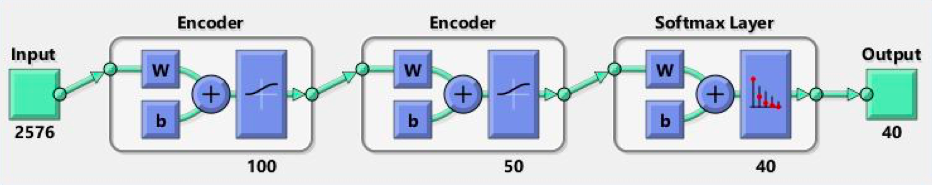
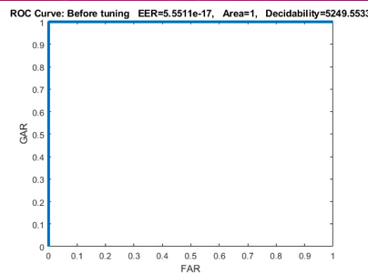

# Neural Network - Verificación Biométrica Facial Mediante Codificador Automático

Lea las carpetas y las imágenes usando el comando cd:: 
 fn = cd(['C:\Users\Ritika\Desktop\Neural Networks\Ritika_Chowdri_AE\s' num2str(i)]); 
 
Normalizado las imágenes entre valores 0 y 1.  
 img = double(img)/256;  
  
 Creó un vector de celda de fila para entrenar y probar imágenes (112 * 92 píxeles cada una).  
  Train_cell = mat2cell(img,112,92);  
		 Test_cell = mat2cell(img,112,92);  
  
 
## Variaciones En los Parámetros de Aprendizaje
Para el primer auto encoder  
	       ‘Hidden_layer1’ = 100  
	       'MaxEpochs‘ = 400  
           
PAra el segundo auto encoder  
		‘Hidden_layer2’ = 50  
		‘MaxEpochs’ = 100  
                'L2WeightRegularization‘ = 0.006 and 0.008  
                'SparsityRegularization‘ = 1 and 3  
                'SparsityProportion‘ = 0.15 and 0.30  
Total 8 combinaciones de L2WR,  SR y SP  

## Usando diferentes combinaciones de los parámetros de aprendizaje, encuentre las mejores representaciones profundas usando codificadores automáticos apilados que maximizan las variaciones entre clases e intraclase (d ') en el sentido -MSE
Primero entrenamos el codificador automático disperso en los datos de entrenamiento sin usar las etiquetas. 
Los pesos se inicializan aleatoriamente antes del entrenamiento. 
El vector de características se genera y se pasa al segundo codificador automático. 
Entrene la capa softmax para clasificar el vector de características de 50 dimensiones. 
  Puntajes genuinos = 600 
  Puntuaciones de impostor = 28080 
  

  

  

  

  

  

## Área bajo la curva

  

## Deepnet Usando Dos Codificadores Automáticos y Una Capa Softmax

  

Tomando la mejor configuración entrenamos la red neuronal y generamos curvas roc para imágenes de prueba

  

## Conclusiones

-La normalización de los datos se realiza para mejorar el rendimiento de la red. 
-Cuanto mayor es la regularización de la dispersión, peor es la curva ROC. 
-Cuanto mayor es la disminución del peso, menor es el efecto de la regularización de la dispersión en la ROC. 
-El ajuste fino de la red mejora el rendimiento. 

## Referencias
Inspirado en el proyecto de: RITIKA CHOWDRI

  

Ramírez Cotonieto Luis Ferando 
Redes Neuronales 
2020630417
